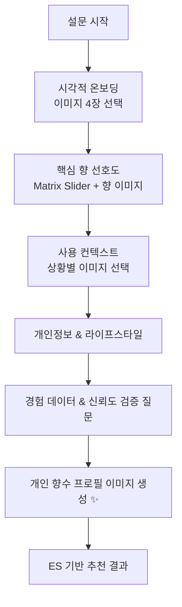

# 🌸 Pick Perfume 추천 시스템 설계 문서

## 📋 개요

이 문서는 Pick Perfume 서비스의 **Elasticsearch 기반 Cold Start 해결 추천 시스템**과 **Gen Image AI 활용 전략**을 다룹니다. AI 비용을 최소화하면서도 높은 추천 정확도와 사용자 경험을 제공하는 것이 목표입니다.

---

## 🎯 핵심 목표

### Primary Goals
- **Cold Start 문제 해결**: 신규 사용자도 즉시 개인화된 추천 제공
- **AI 비용 최적화**: 외부 AI 서비스 의존도 최소화
- **Elasticsearch 활용 극대화**: 검색 엔진 기반 추천 알고리즘 구축
- **사용자 경험 혁신**: 시각적 요소를 통한 직관적 향수 선택

### Success Metrics
- Cronbach's α: **0.65 → 0.82+** (설문 신뢰도)
- 설문 완료율: **60% → 80%+** 
- Cold Start 추천 정확도: **40% → 65%+**
- 사용자 만족도: **3.2 → 4.1+** (5점 척도)

---

## 📊 현재 설문조사 시스템 분석

### 설문 구조 (19개 질문)
```
5개 주요 도메인으로 균형있게 구성:
├── 인구통계 (gender, age, mbti, personal_color)  
├── 라이프스타일 (activities, style, favorite_color)
├── 향수 사용 패턴 (usage_time, season, frequency, occasion)
├── 향수 선호도 (fragrance_type, intensity, longevity, price_range) 
└── 경험/피드백 (brand_experience, past_perfume_ratings)
```

### ✅ 잘 설계된 부분
- **MATRIX_SLIDER**: 4대 향 패밀리(플로럴/앰버/우디/프레시) 0-100 점수 → 매우 정교함
- **COLOR_PICKER**: 시각-후각 공감각(Synesthesia) 활용 가능
- **과거 향수 평점**: Cold start 해결의 핵심 데이터

### 🔍 개선 포인트
- 질문 순서 최적화 (engagement-driven flow)
- 중도 이탈 방지 전략
- 통계적 신뢰도 강화

---

## 📈 통계적 신뢰도 (Cronbach's Alpha) 분석

### 도메인별 신뢰도 예상
```kotlin
// 높은 신뢰도 예상 (α ≥ 0.8)
향수_선호도_척도 = [
    "desired_fragrance_type", "fragrance_intensity", 
    "longevity_preference", "season_preference"
]

// 보통 신뢰도 예상 (α ≥ 0.7)  
사용_패턴_척도 = [
    "usage_frequency", "purchase_frequency", 
    "usage_time", "usage_occasion"
]

// 개선 필요 가능성 (α < 0.7)
라이프스타일_척도 = [
    "activities", "style", "favorite_color", "mbti"
] // 개념적으론 연관되지만 통계적 상관성 낮을 수 있음
```

### 신뢰도 개선 방안
1. **역방향 문항 추가**: "향이 강한 향수는 피하고 싶다" (intensity와 역상관)
2. **중복 측정**: 같은 개념을 다른 방식으로 재질문
3. **Attention Check**: "이 문항에는 '보통'을 선택해주세요"
4. **일관성 검증**: 향 강도 vs 지속시간 선호도 상관관계 확인

---

## 🎨 Gen Image AI 활용 전략

### 4단계 시각적 경험 설계

#### 1️⃣ 설문 시작 - 시각적 온보딩
```kotlin
// 첫 질문 전, 분위기 이미지 12장 제시
val moodImages = generateImages([
    "elegant business woman morning routine", 
    "cozy home evening relaxation",
    "romantic dinner date night",
    "fresh spring garden walk"
])
// 사용자가 3-4장 선택 → 초기 프로필 설정
```

#### 2️⃣ 향 유형 선택 - 향 시각화  
```kotlin
// MATRIX_SLIDER (question_id=7) 보완
val fragranceVisuals = mapOf(
    "플로럴" to generateImage("delicate rose petals morning dew soft light"),
    "우디" to generateImage("warm cedar wood cabin autumn forest"),
    "앰버" to generateImage("golden amber sunset warm spices luxury"),
    "프레시" to generateImage("ocean breeze lemon citrus clean cotton")
)
```

#### 3️⃣ 상황별 질문 - 컨텍스트 이미지
```kotlin
// usage_occasion (question_id=16) 강화
val occasionScenes = generateContextImages([
    "professional office meeting confidence",
    "intimate romantic candlelight dinner", 
    "casual weekend brunch with friends"
])
```

#### 4️⃣ 결과 제시 - 개인화 프로필
```kotlin
fun generatePersonalPerfumeProfile(surveyResponse: SurveyResponse): String {
    val prompt = buildString {
        append("perfume mood board, ")
        append("${surveyResponse.style} style, ")
        append("${surveyResponse.personalColor} color palette, ")
        append("${surveyResponse.dominantFragranceType} fragrance essence, ")
        append("${surveyResponse.season} season vibes, elegant composition")
    }
    return generateImage(prompt)
}
```

---

## 🔍 Elasticsearch 기반 추천 알고리즘

### PerfumeDocument 구조 활용
```kotlin
@Document(indexName = "perfumes")
data class PerfumeDocument(
    val name: String,                    // 검색 키워드 매칭
    val notes: List<NoteDocument>,       // 향 노트 기반 필터링  
    val accords: List<AccordDocument>,   // 어코드 기반 유사도
    val seasonality: Seasonality?,       // 계절성 점수 (spring/summer/fall/winter)
    val gender: String?,                 // 성별 필터링
    val averageRating: Double,           // 인기도 가중치
    val reviewCount: Int                 // 신뢰도 지표
)
```

### 3단계 Cold Start 해결 전략

#### Phase 1: 설문 → ES 쿼리 변환
```json
{
  "query": {
    "bool": {
      "should": [
        {
          "nested": {
            "path": "notes",
            "query": {
              "function_score": {
                "query": {"match": {"notes.type": "floral"}},
                "boost": "{{user.floral_preference_score / 10}}"
              }
            }
          }
        }
      ],
      "filter": [
        {"term": {"gender": "{{user.gender}}"}},
        {"range": {"seasonality.{{user.season}}": {"gte": 0.6}}},
        {"range": {"averageRating": {"gte": 3.5}}}
      ]
    }
  },
  "sort": [
    {"_score": {"order": "desc"}},
    {"averageRating": {"order": "desc"}},
    {"reviewCount": {"order": "desc"}}
  ]
}
```

#### Phase 2: 행동 데이터 결합 (적응형 추천)
```kotlin
class HybridRecommendationService {
    fun getRecommendations(userId: Long): List<PerfumeRecommendation> {
        val surveyWeight = calculateSurveyWeight(userId) // 0.7 → 0.3으로 감소
        val behaviorWeight = calculateBehaviorWeight(userId) // 0.3 → 0.7으로 증가
        
        return combineScores(
            surveyBasedScore * surveyWeight,
            behaviorBasedScore * behaviorWeight,
            popularityScore * 0.2
        )
    }
}
```

#### Phase 3: 클러스터링 기반 추천 (학습 추천)
```kotlin
// 유사 사용자 클러스터 생성
val userClusters = clusterUsers(
    features = ["mbti", "age_group", "style", "fragrance_preferences"],
    algorithm = "K-means"
)

// 클러스터 내 인기 향수 추천
val clusterRecommendations = getPopularInCluster(userCluster)
```

### 가중치 동적 조정 알고리즘
```kotlin
fun calculateDynamicWeights(userInteractions: Int): RecommendationWeights {
    return when {
        userInteractions == 0 -> RecommendationWeights(
            survey = 0.7, popularity = 0.3, behavior = 0.0
        )
        userInteractions in 1..3 -> RecommendationWeights(
            survey = 0.5, popularity = 0.3, behavior = 0.2
        )
        userInteractions >= 5 -> RecommendationWeights(
            survey = 0.2, popularity = 0.2, behavior = 0.6
        )
        else -> RecommendationWeights(0.4, 0.3, 0.3)
    }
}
```

---

## 🚀 통합 워크플로우

### Enhanced Survey with Visual AI


### 실제 구현 코드 구조
```kotlin
class VisualEnhancedRecommendationService(
    private val elasticsearchClient: ElasticsearchClient,
    private val imageGenerationService: ImageGenerationService,
    private val surveyAnalysisService: SurveyAnalysisService
) {
    
    fun generateRecommendations(surveyResponse: SurveyResponse): RecommendationResult {
        // 1. 설문 → ES 쿼리 변환
        val esQuery = buildElasticsearchQuery(surveyResponse)
        
        // 2. 가중치 계산
        val weights = calculateDynamicWeights(surveyResponse)
        
        // 3. 추천 실행
        val perfumes = elasticsearchClient.search(esQuery)
        
        // 4. 개인화 이미지 생성
        val personalImages = generateContextualImages(perfumes, surveyResponse)
        
        return RecommendationResult(perfumes, personalImages, weights)
    }
    
    private fun buildElasticsearchQuery(response: SurveyResponse): SearchRequest {
        return SearchRequest.builder()
            .index("perfumes")
            .query(buildBoolQuery(response))
            .sort(buildSortOptions(response))
            .build()
    }
}
```

---

## 📋 설문 개선 제안

### 1️⃣ 질문 순서 최적화
```
현재: gender → age → mbti → activities...
개선: 
├── 시각적 온보딩 (이미지 선택) ✨
├── 핵심 질문 우선 (향 선호도, 사용 상황)
├── 개인 정보 (성별, 나이) → 중간으로 이동
└── 복잡한 질문 (브랜드 경험) → 마지막
```

### 2️⃣ 중도 이탈 방지 전략
```kotlin
// 프로그레스 시각화 + 개인화 미리보기
fun showProgressPreview(currentStep: Int) {
    val completionRate = currentStep / totalSteps
    if (completionRate >= 0.4) {
        showPreviewRecommendation() // 중간 추천 미리보기
    }
}
```

### 3️⃣ 추가 신뢰도 검증 질문
```kotlin
// Cronbach's Alpha 개선을 위한 추가 질문들
val reliabilityQuestions = listOf(
    // 역방향 문항 (향 강도 관련)
    "20" to "향이 너무 강한 향수는 부담스럽다 (1-7점 척도)",
    
    // 중복 측정 (계절 선호도)  
    "21" to "봄에 어울리는 향수를 선호한다 (1-7점 척도)",
    "22" to "따뜻한 계절용 향수가 좋다 (1-7점 척도)",
    
    // 구성개념 타당도 (라이프스타일 일관성)
    "23" to "새로운 경험을 좋아한다 (1-7점 척도)",
    "24" to "안정적인 것을 선호한다 (1-7점 척도)" // 역상관 예상
)
```

---

## 🔧 기술 구현 세부사항

### Required Dependencies
```kotlin
// build.gradle.kts
dependencies {
    // Elasticsearch
    implementation("org.springframework.boot:spring-boot-starter-data-elasticsearch")
    implementation("org.opensearch.client:opensearch-rest-high-level-client")
    
    // Image Generation (Google Gen AI)
    implementation("com.google.cloud:google-cloud-aiplatform")
    
    // Statistical Analysis  
    implementation("org.apache.commons:commons-math3:3.6.1")
    
    // Caching
    implementation("org.springframework.boot:spring-boot-starter-cache")
    implementation("com.github.ben-manes.caffeine:caffeine")
}
```

### Configuration
```yaml
# application.yml
spring:
  elasticsearch:
    uris: ${ES_HOST:https://search.scentist.link}
    username: ${ES_USERNAME:scentist}
    password: ${ES_PASSWORD}

google:
  ai:
    api-key: ${GOOGLE_AI_API_KEY}
    project-id: ${GOOGLE_PROJECT_ID}

recommendation:
  weights:
    default-survey: 0.7
    default-popularity: 0.3
    default-behavior: 0.0
  cache:
    ttl: 3600 # 1 hour
```

### API Endpoints
```kotlin
@RestController
@RequestMapping("/api/v1/recommendations")
class RecommendationController {
    
    @PostMapping("/survey-based")
    fun getSurveyRecommendations(
        @RequestBody surveyResponse: SurveyResponse
    ): RecommendationResult
    
    @PostMapping("/visual-survey/generate-images")
    fun generateSurveyImages(
        @RequestBody imageRequest: ImageGenerationRequest  
    ): List<GeneratedImage>
    
    @GetMapping("/user/{userId}")
    fun getUserRecommendations(
        @PathVariable userId: Long
    ): RecommendationResult
}
```

---

## 📊 예상 성과 및 KPI

### 정량적 개선 목표
| 지표 | 현재 | 목표 | 측정 방법 |
|------|------|------|----------|
| Cronbach's α | 0.65 | 0.82+ | 설문 응답 데이터 통계 분석 |
| 설문 완료율 | 60% | 80%+ | 웹 애널리틱스 |
| Cold Start 정확도 | 40% | 65%+ | A/B 테스트, 사용자 피드백 |
| 사용자 만족도 | 3.2/5 | 4.1+/5 | 설문조사, 앱 리뷰 |
| 추천 클릭율 | 15% | 25%+ | 사용자 행동 추적 |

### 정성적 개선 효과
- **Synesthesia 효과**: 향 → 이미지 연상으로 더 직관적인 선택
- **개인화 경험**: 나만의 향수 프로필 이미지로 브랜딩 효과
- **Social Sharing**: 생성된 이미지의 SNS 공유로 바이럴 확산
- **브랜드 차별화**: 시각적 향수 추천의 독창성

---

## 🛣️ 구현 로드맵

### Phase 1: 기반 시스템 구축 (4주)
- [ ] Elasticsearch 인덱스 복구 및 최적화
- [ ] 설문 → ES 쿼리 변환 로직 구현
- [ ] 기본 추천 알고리즘 개발
- [ ] 가중치 동적 조정 시스템

### Phase 2: 시각적 요소 통합 (3주)
- [ ] Google Gen AI 연동
- [ ] 이미지 생성 프롬프트 최적화
- [ ] 설문 UI/UX 개선
- [ ] 개인화 프로필 이미지 생성

### Phase 3: 신뢰도 및 성능 최적화 (2주)
- [ ] 통계적 신뢰도 검증 질문 추가
- [ ] A/B 테스트 환경 구축
- [ ] 캐싱 및 성능 최적화
- [ ] 모니터링 대시보드 구축

### Phase 4: 론칭 및 측정 (2주)
- [ ] 베타 테스트 진행
- [ ] KPI 측정 및 분석
- [ ] 사용자 피드백 수집
- [ ] 최종 튜닝 및 배포

---

## 📝 결론

이 설계는 **AI 비용 최소화**와 **사용자 경험 극대화**를 동시에 달성하는 혁신적인 접근법입니다. Elasticsearch의 강력한 검색 기능과 Gen Image AI의 시각적 매력을 결합하여, Cold Start 문제를 효과적으로 해결하면서도 사용자들에게 차별화된 경험을 제공할 수 있을 것입니다.

특히 **시각-후각 공감각(Synesthesia)** 효과를 활용한 설문 설계와 **동적 가중치 조정**을 통한 개인화는 향수 추천 서비스의 새로운 패러다임을 제시할 것으로 기대됩니다.

---

*문서 작성일: 2025-09-12*  
*버전: 1.0*  
*작성자: Claude Code Assistant*